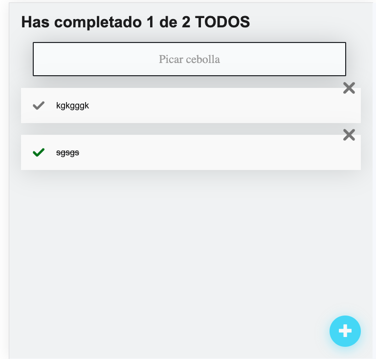

#Listado de TODOS con React.js

En este repositorio encontrarás el código de la app de listado de TODOS. Para la persistencia de los datos se hace uso inicialmente de localstorage, con la idea de mejorarlo con el tiempo y hacer request hacia un servidor de nodejs para extraer información del listado de TODOS de una Base de datos Mondodb.

Para empezar solo debes clonar este repositorio (`git clone`), instalar sus dependencias (`npm i`) y ejecutar la aplicación (`npm start`).

La rama principal contiene el código fuente.

¡Mucha suerte aprendiendo React! #NuncaParesDeAprender
### Screenshot

##Levantar la aplicación

Para levantar la aplicación en tu máquina localmente, sigue los siguientes pasos:

- En el directorio del proyecto ejecuta:

### `npm start`

- Una vez finalizado el proceso se abrirá la vista en tu navegador con la siguiente ruta:
 [http://localhost:3000]

### Links

- Live Site URL: [Click here](https://65c2e4eb5cd9d51b594e94c9--strong-pixie-c1bcb6.netlify.app/)

### Construido con

- Semantic HTML5 markup
- CSS 
- ReactJs
- Skeleton

## Author

- @snatera